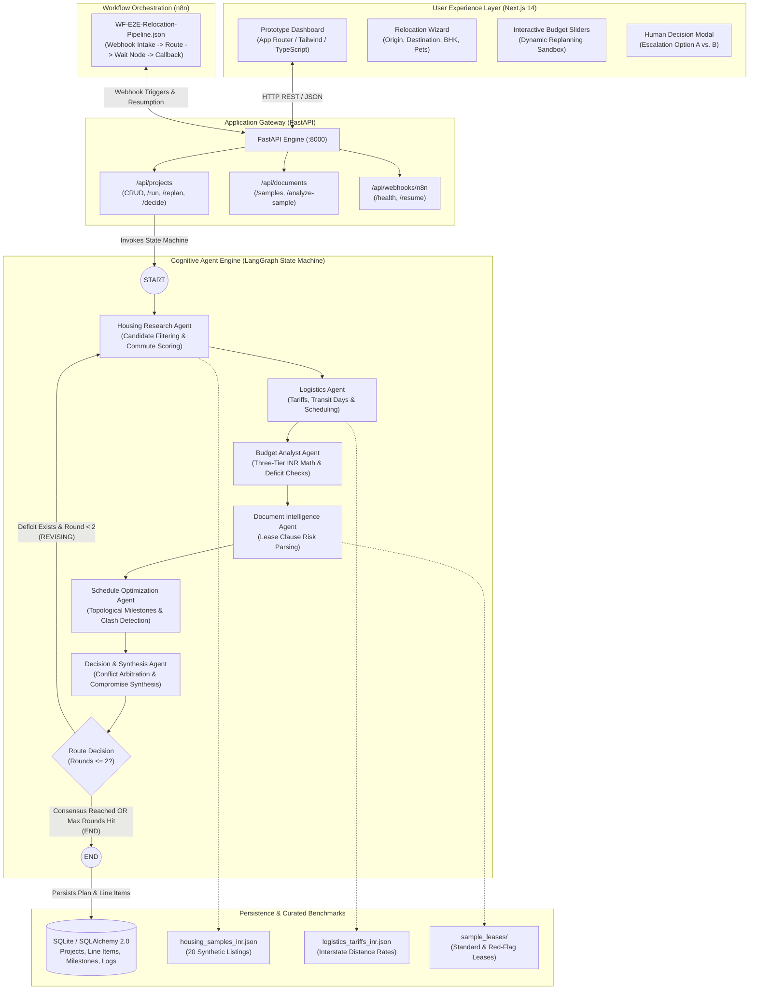

# NEXMOVE: Autonomous Multi-Agent AI Relocation Assistant

> **A multi-agent relocation platform featuring LangGraph cognitive reasoning, bounded revision looping, three-tier INR financial segregation, safe contract intelligence, a FastAPI service gateway, n8n pipeline orchestration, and a Next.js interactive prototype dashboard.**

---

## 1. System Architecture



---

## 2. Six Specialized Domain Agents

| Agent Name | Core Responsibilities | Decision Rules & Constraints | Fallback / Revision Strategy |
| :--- | :--- | :--- | :--- |
| **Housing Research Agent** | Filters rental listings by BHK, commute time to workplace, and pet accommodation. | `has_pets=True` is a **hard constraint**; non-pet listings are strictly omitted. | Under revision requests, selects units with lower base rent and deposit while maintaining pet and commute bounds. |
| **Logistics Agent** | Estimates freight volume, vehicle requirements, interstate tariffs, and transit days. | Computes pickup and delivery dates based on route distance (e.g. 840 km Pune $\rightarrow$ BLR). | Under budgetary pressure, adapts from dedicated container (3 days) to shared economy transit (5 days). |
| **Budget Analyst Agent** | Strictly segregates finances into three tiers: One-Time Relocation, Initial Housing Outlay, Recurring Monthly Living. | Asserts: $C_{reloc} + C_{housing\_init} \le B_{upfront}$ and $C_{monthly} \le B_{monthly}$. | Flags `AUDIT_FAIL` with exact deficit amount ($\Delta$) and passes conflict context to Decision Agent. |
| **Document Intelligence Agent** | Parses tenancy contracts, extracts rent/deposit terms, and flags risk clauses for user review. | Detects non-refundable deductions, strict pet bans, and restrictive move-in delivery hours. | Attaches mandatory **informational legal disclaimer** clarifying that findings do not constitute legal advice. |
| **Schedule Optimization Agent** | Sequences critical-path milestones and validates topological order. | Detects date clashes (e.g. movers arrive before apartment lease access). | Computes corrective offset days and annotates elevator/unloading time restrictions from lease audit. |
| **Decision & Synthesis Agent** | Detects cross-agent conflicts, arbitrates compromises, and bounds revisions. | Enforces maximum **2 revision rounds**. If unresolvable, generates human escalation options. | Creates Option A (budget expansion) and Option B (commute/freight compromise) for user decision. |

---

## 3. Three-Tier Financial Segregation (INR - ₹)

To prevent financial conflation, NEXMOVE enforces strict mathematical separation:
1. **Tier 1: One-Time Relocation Costs ($C_{reloc}$)**: Packers & movers freight, transit insurance, travel tickets, packing materials.
2. **Tier 2: Initial Housing Outlay ($C_{housing\_init}$)**: Security deposit, advance month-1 rent, move-in onboarding fee.
   $$\mathbf{Upfront\ Capital\ Assertion:}\quad C_{upfront} = C_{reloc} + C_{housing\_init} \le B_{upfront}$$
3. **Tier 3: Recurring Monthly Spend ($C_{monthly}$)**: Base rent, society maintenance, estimated utilities, daily commute fares.
   $$\mathbf{Monthly\ Operational\ Assertion:}\quad C_{monthly} \le B_{monthly}$$

---

## 4. Benchmark Evaluation Results (10 Scenarios)

All 10 benchmark scenarios are codified in `backend/tests/test_benchmarks.py` and run via `pytest`:

| # | Benchmark Scenario | Objective | Outcome | Result |
| :-: | :--- | :--- | :--- | :-: |
| **1** | **Feasible Relocation** | Healthy budget limits achieve single-pass consensus in Round 1 | `CONSENSUS_REACHED` (Round 1/2), 0 conflicts | **PASSED** |
| **2** | **Upfront Budget Overrun** | ₹120,000 cap triggers negotiation and resolves in Round 2 | Adapted to 1BHK + economy freight, ₹16k buffer | **PASSED** |
| **3** | **Monthly Budget Overrun** | ₹26,000 monthly ceiling forces lower rent selection | Selected ₹18k/mo unit, recurring total $\le$ cap | **PASSED** |
| **4** | **Impossible Budget Escalation** | ₹40,000 cap caps at 2 rounds and escalates to human | `AWAITING_USER_DECISION`, Options A & B generated | **PASSED** |
| **5** | **Pet Restriction Preservation** | Family pet constraint strictly preserved under revision | Pet-friendly property selected; non-pet filtered out | **PASSED** |
| **6** | **Lease & Delivery Conflict** | Delivery arriving 3 days before lease access flagged | `DELIVERY_BEFORE_LEASE_START` flagged, +3d offset | **PASSED** |
| **7** | **Red-Flag Lease Audit** | Identifies non-standard penalty clauses in lease contract | 3 clauses flagged (painting, pet ban, elevator hours) | **PASSED** |
| **8** | **Budget Cut Replanning** | Budget reduction from ₹160k to ₹115k recomputes state | Stale proposal purged, compliant plan generated | **PASSED** |
| **9** | **Move Date Shift Replanning** | Target move date shifted from Nov 5 to Dec 25 | All 6 milestones and logistics dates shift cleanly | **PASSED** |
| **10** | **Corrupted / Missing Inputs** | Non-existent lease and negative budgets handled gracefully | Parse returns `FAILED`, Pydantic raises validation error | **PASSED** |

Full documentation available in [`docs/benchmark_evaluation_report.md`](file:///Users/omikashrestha/Desktop/NEXMOVE%20-%20flexi/docs/benchmark_evaluation_report.md).

---

## 5. Quick Start & Execution Guide

### Prerequisites
- **Python 3.11, 3.12, or 3.14** (Verified compatible on macOS ARM64 and Linux)
- **Node.js 18+ and npm**
- **Git**

### Step 1: Backend Setup & Verification
```bash
# Clone and enter workspace
cd "NEXMOVE - flexi"

# Setup virtual environment
python3 -m venv .venv
source .venv/bin/activate

# Install Python dependencies
pip install -r backend/requirements.txt

# Run complete test suite (61 tests across agents, API, audit, benchmarks, DB, schemas)
PYTHONPATH=. pytest -v backend/tests
```

### Step 2: Interactive Dynamic Replanning Demonstration
Run the standalone terminal demonstration script exercising the normal plan, a budget cut triggering agent re-negotiation, and an impossible-budget case requesting human decision:
```bash
.venv/bin/python scripts/demo_replanning.py
```

### Step 3: Run the FastAPI Application
```bash
source .venv/bin/activate
uvicorn backend.app.main:app --host 0.0.0.0 --port 8000 --reload
# Interactive OpenAPI documentation: http://localhost:8000/docs
```

### Step 4: Run the Next.js Prototype Dashboard
```bash
cd frontend
npm install
npm run build   # Production compile verification
npm run dev     # Dashboard available at http://localhost:3000
```

### Step 5: n8n Workflow Automation
Import [`n8n/workflows/WF-E2E-Relocation-Pipeline.json`](file:///Users/omikashrestha/Desktop/NEXMOVE%20-%20flexi/n8n/workflows/WF-E2E-Relocation-Pipeline.json) into n8n (`http://localhost:5678`) to inspect the 9-node orchestration pipeline.

---

## 6. Team & Workstream Ownership

| Member | GitHub Username | Role & Workstream Ownership |
| :--- | :--- | :--- |
| **Omika Shrestha** | [`omikashrestha`](https://github.com/omikashrestha) | LangGraph State Core, Decision & Synthesis Agent, Replanning API router |
| **Pritika Kurup** | [`pritikakurup`](https://github.com/pritikakurup) | Housing Research Agent, Document Intelligence Agent, Benchmark Datasets |
| **Neel Khule** | [`wyvern10101`](https://github.com/wyvern10101) | Budget Analyst Agent (INR Math), Schedule Optimization Agent, n8n Workflow |
| **Tanmay Salunkhe** | [`tanmays23`](https://github.com/tanmays23) | Logistics Agent, SQLAlchemy DB Models, Next.js Prototype Dashboard |

---

## 7. System Boundaries, Disclaimers & Known Limitations

1. **Synthetic Demonstration Benchmarks**: All rental properties, society maintenance fees, and logistics tariffs are curated synthetic benchmark records calibrated to realistic Pune $\rightarrow$ Bengaluru market conditions. NEXMOVE does not access live MLS rental listings or commercial mover dispatch networks.
2. **Informational Document Intelligence**: Lease contract clause audits identify regional common-practice risk patterns for educational and review purposes only. They **do not constitute legal advice** or formal attorney representation.
3. **No Commercial Bookings or Financial Transactions**: NEXMOVE does not charge bank accounts, transfer security deposits, or execute binding contracts.
4. **n8n Runtime Status**: The workflow definition [`WF-E2E-Relocation-Pipeline.json`](file:///Users/omikashrestha/Desktop/NEXMOVE%20-%20flexi/n8n/workflows/WF-E2E-Relocation-Pipeline.json) is fully exported and structurally verified. However, live runtime webhook execution remains **unverified** unless an active local n8n daemon is launched and configured.

---

## 8. Milestone Completion Status
- [x] **Milestone 1**: Foundation, Pydantic schemas, SQLAlchemy models, synthetic INR benchmark datasets, and unit test suite (18 tests).
- [x] **Milestone 2**: 6 Domain Agents, LangGraph state machine, revision loop, and audit tests (41 tests).
- [x] **Milestone 3**: Orchestration (FastAPI gateway, n8n workflow, Next.js prototype dashboard, local integration smoke test, 51 tests).
- [x] **Milestone 4**: 10 Benchmark evaluation scenarios, interactive replanning demonstration script, submission documentation, and complete verification (61 tests passing).
